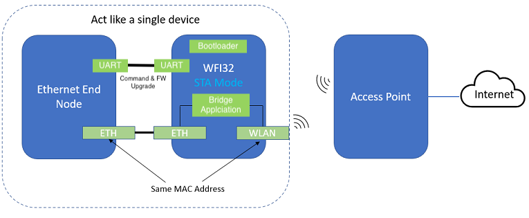
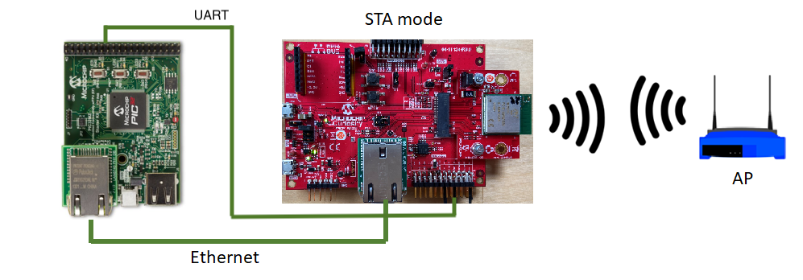
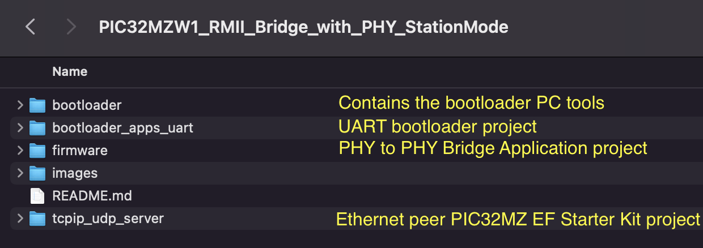
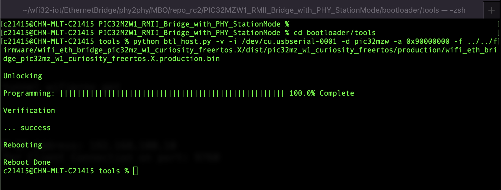
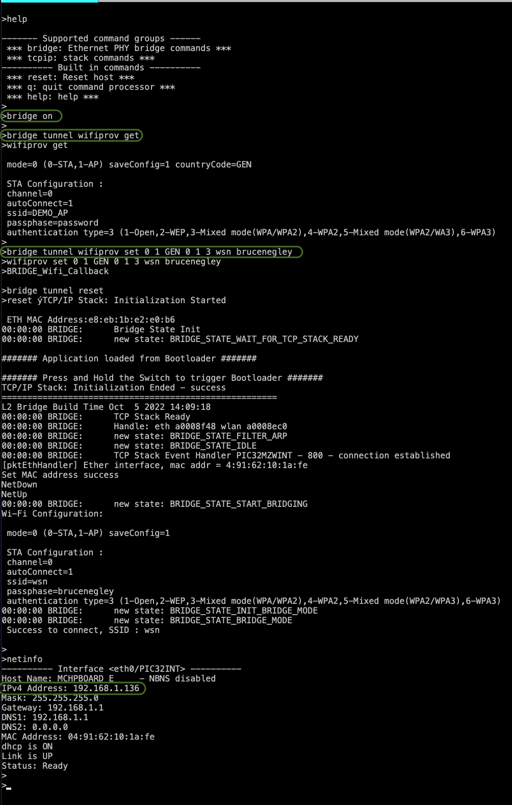
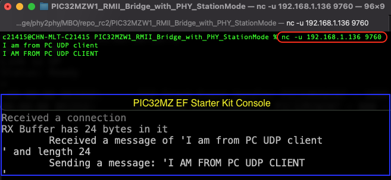

# Ethernet to WiFi Bridge with PHY 

> "Wireless Made Easy!" - This example application acts as a bridge to bridge up WiFi and ETH interface of WFI32 device, WFI32 set as Wi-Fi Station(STA) mode to connect to Access point(AP). The WFI32 device help connect ETH end node to the Access point (AP) in this example.

Devices: **WFI32E01**

## Description

The goal is to provide a turnkey solution to enable wireless connectivity on a Ethernet Phy based node. 

The project includes a UART based bootloader and command interface to configure the WFI32 based wireless interface. It enables easier upgrade of WFI32 wireless node firmware and command interface to configure the wireless interface.

## Software requirement

The sample project has been created and tested with the following Software Development Tools:
- [MPLAB X IDE v6.00](https://www.microchip.com/en-us/tools-resources/develop/mplab-x-ide)
- [MPLAB XC32 v3.01](https://www.microchip.com/en-us/tools-resources/develop/mplab-xc-compilers)
- MPLAB Harmony v3.6.4
   - mhc v3.8.2
   - csp v3.10.0
   - core v3.10.0
   - wireless_wifi v3.7.0 (release soon)
   - dev_packs v3.10.0
   - wireless_system_pic32mzw1_wfi32e01 v3.6.1
   - wolfssl v4.7.0
   - net v3.7.4
   - crypto v3.7.4
   - CMSIS-FreeRTOS v10.3.1

## Hardware requirement
   - [WFI32E Curiosity board](https://www.microchip.com/en-us/development-tool/EV12F11A)
   - [PIC32MZ EF Starter kit](https://www.microchip.com/en-us/development-tool/DM320007-C)
   - [PHY Daughter board]()
   - Access point or Wi-Fi Router
   - Micro and Mini USB cables
   - Ethernet cable

## Block Diagram

The following diagram illustrates various componets involved in this solution

There are mainly 3 software components on the WFI32 Wi-Fi module. 

**1. UART based Bootloader**

The UART bootloader project ../bootloader_apps_uart/apps/uart_bootloader/bootloader/firmware/pic32mz_w1_curiosity.X is flashed into the WFI32 device. The purpose of the bootloader is to enable the application/firmware upgrade though the UART interface. In this solution same UART is connected to the Ethernet peer devcie. It enables the capability to update the WFI32 device in the field. Refer to the UART based bootloader user guide at the [link](https://github.com/Microchip-MPLAB-Harmony/bootloader_apps_uart/blob/master/apps/uart_bootloader/docs/readme_pic32mz_w1_curiosity.md)

**2. Ethernet bridge Application**

The main application demonstrates how a ETH end node can connect to a WiFi network through WFI32 device. The WFI32 device is set as Wi-Fi Station (STA) mode to connect the Accesss point (AP) and act as a Wi-Fi ETH bridge to bridge up the Wi-Fi and Ethernet interface. In the setup, ETH end node connect to the Ethernet connector of WFI32 device and exchange data with the Access Point through the WFI32 device. 

The application process the IP packets that received from the Wi-Fi and ETH interface at bridge.c. The code in this file act as a transparent bridge to receive and forward the network packets to and from both Wi-Fi and ETH interface. It set the mac address of WFI32 to be the same as Ethernet end node so that the Ethernet end node can communicate with the AP. As both Ethernet end node and WFI32 are using the same mac address, they are acting as a single unit in the network.

Note:- The bridge applicaiton does not use the H3 L2 Bridge feature. 

The user would need to configure the Home AP credentials (like SSID and security items). The Wi-Fi service running on WFI32 device will use the credentials to connect to the Home AP.The default application will try to establish a connection to AP "DEMO_AP" with WPA2 security and password as a "password".

**3. Ethernet Host Application**

It is an PIC32MZ EF SK based example network application (tcpip_udp_server), it acts as the Ethernet host application with a UDP server listening for incoming connection. It uses the Ethernet PHY interface to access the WFI32 board Wi-Fi interface. 

The example applicaiton is capable of accessing the WFI32 CLI commands, the UART console interface tunnels the user commands to WFI32 UART interface.

The "bridge" command is used to link the WFI32 CLI interface on PIC32MZ EF SK console. 
   - '*>bridge on/off*' -> Enables/Disables the WFI32 CLI interface on the PIC32MZ console interface
   - '*>bridge tunnel <WFI32 CLI commands>* -> Triggers the WFI32 CLI commands from the PIC32MZ console interface

Note:- The current PIC32MZ EF SK example includes only bridge support for command interface. **It doesn't include the capability to upgrade/flash the WFI32 module firmware/application**. In order to have the upgrade feature from host(PIC32MZ EF SK), the python command used with the [bootloader](https://github.com/Microchip-MPLAB-Harmony/bootloader_apps_uart/blob/master/apps/uart_bootloader/docs/readme_pic32mz_w1_curiosity.md) needs to be ported on PIC32 MZ SK.

## Downloading and building the application

To download or clone this application from Github, issue the following git command.

>git clone --recurse-submodules https://github.com/c21415/PIC32MZW1_RMII_Bridge_with_PHY_StationMode.git

The successful cloning of the repo would result in following folders

| Project Name      | Description                                    |path    |
| ----------------- | ---------------------------------------------- |--------|
|pic32mz_w1_curiosity.X| MPLABX project for WFI32 UART Bootloader |./bootloader_apps_uart/apps/uart_bootloader/bootloader/firmware|
| wifi_eth_bridge_pic32mz_w1_curiosity_freertos.X | MPLABX project for PIC32MZ W1 Curiosity Board | ./firmware|
|pic32mz_ef_sk.X| MPLABX project for PIC32 MZ EF Starter Kit(Ethernet Host board) |./tcpip_udp_server/firmware |
||||

Download and install a serial terminal program like [TeraTerm](https://osdn.net/projects/ttssh2/releases/). Launch TeraTerm program and configure the serial ports mounted with: **115200 bps, 8 N 1**

#### Prepare WFI32E Curiosity Board

1. Connect the Debug USB port on the board to the computer using a micro USB cable

2. On the GPIO Header (J207), connect U1RX (PIN 13) and U1TX (PIN 23) to TX and RX pin of any USB to UART converter (for eg: USB UART click board)

3. Open the Ethernet Bridge application project *./firmware/wifi_eth_bridge_pic32mz_w1_curiosity_freertos.X* in the IDE

4. Build the project to generate the binary **(Do not program the binary)**

5. Open the bootloader project *bootloader_apps_uart/apps/uart_bootloader/bootloader/firmware/pic32mz_w1_curiosity.X* in the MPLABX IDE

6. Build and program the application using the IDE

7. Run the **btl_host.py** from command prompt to program the application binary

>cd bootloader/tools
>
>python btl_host.py -v -i <COM PORT> -d pic32mzw -a 0x90000000 -f ./firmware/wifi_eth_bridge_pic32mz_w1_curiosity_freertos.X/dist/pic32mz_w1_curiosity_freertos/production/wifi_eth_bridge_pic32mz_w1_curiosity_freertos.X.production.bin

8. Following snapshot shows output of successfully programming the test application
    - **Rebooting** and **Reboot Done** messages in below output signifies that bootloading is successful

9. If above step is successful then the **RED LED (D202)** should start blinking

Note:- Press and hold of the Switch **SW1/SW200** can trigger Bootloader from main application 

#### Prepare PIC32MZ EF SK(Starter Kit) Board

1. Open the Ethernet Bridge application project *./tcpip_udp_server/firmware/pic32mz_ef_sk.X* in the MPLABX IDE

2. Build and program the application on PIC32MZ EF SK(Starter Kit)

3. Now connect the PIC32MZ EF Starter kit UART1 interface to WFI32 Curiosity board console UART as specified in the following table.

	| PIC32 EF Starter Kit  | WFI32E Curiosity Board  |
	|:----------|:----------|
	| J12-Pin#15 (U1Tx)    | J207-Pin#13 (U1Rx)       |
	| J12-Pin#37 (U1Rx)    | J207-Pin#23 (U1Tx)       |
	| J12-Pin#39 (GND)   | J207-Pin#17 (GND)          |

4. Open the Terminal application (Ex.:Tera term) on the computer

5. Connect the Debug USB port on PIC32MZ EF SK board to the computer using a mini USB cable and configure the serial settings as follows:
    - Baud : 115200
    - Data : 8 Bits
    - Parity : None
    - Stop : 1 Bit
    - Flow Control : None

6.  Connect the ETH client to the ETH connector of the Cuisoity board 

## Running the Application

1.	On the PIC32MZ EF SK(Starter Kit) console interface issue the *bridge on* command 

2.  Now PIC32MZ EF SK can issue the *bridge tunnel <WFI32 board CLI commands>* from its console

3.  Configure the home AP or Wi-Fi router details using the following command

> bridge tunnel **wifiprov set 0 1 GEN 0 1 3 wsn brucenegley**

4.  Above command will modify the Wi-Fi configuration and make the WFI32 device to connect with *wsn* router with *brucenegley* password with *mixed mode(3)* security

Following command sequence showcases the method to change the WiFi configuration on the WFI32 board.

5.   Now the WFI32 device will connect to provided home AP and bridges the Wi-Fi link to Ethernet peer PIC32MZ EF SK.

6.   The PIC32MZ EF SK board gets the DHCP resolved and *netinfo* command shown above shows its IP address

9.	Now any client connected to same home AP can access the PIC32MZ EF SK board.

10. The tcpip_udp_server application can be accessed from any UDP client in the same network

